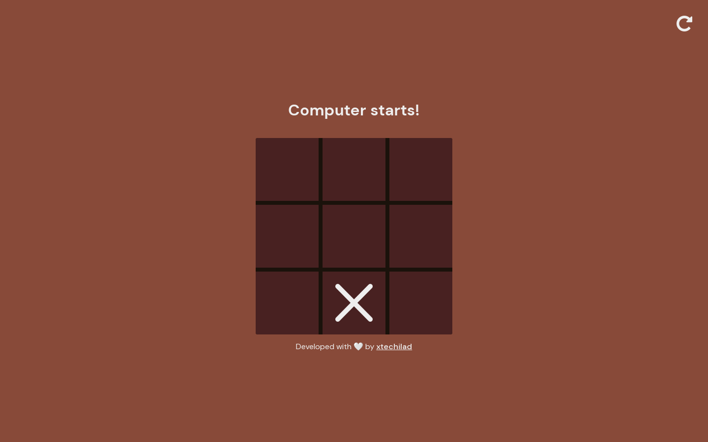

# Tic Tac Toe Game



This repository contains a simple Tic Tac Toe game implemented using HTML, CSS, and JavaScript. The game allows users to compete against the computer on a 3x3 grid.

## Game Features

- User-friendly interface with a responsive design.
- Real-time gameplay.
- Alternate turns between players (User and Computer).
- Automatic detection of winning combinations and declaration of the winner.
- Option to restart or reset the game and play again.

## Technologies Used

The game is built using the following technologies:

- HTML: Provides the structure and layout of the game.
- CSS: Adds styles and visual enhancements to the game interface.
- JavaScript: Implements the game logic and interactivity.

## Getting Started

To get started with the Tic Tac Toe game, follow these steps:

1. Clone the repository to your local machine using the following command:

```bash
  git clone https://github.com/PriyanshuSharma0326/tic-tac-toe.git
```


2. Navigate to the project directory:

```bash
  cd cd tic-tac-toe
```

3. Open the `index.html` file in your preferred web browser.

## Usage

- Upon opening the game, you will see a 3x3 grid representing the Tic Tac Toe board.
- The game may start with the user's turn or the computer's turn.
- The game continues until one player wins or the game ends in a draw.
- If a player wins, a message will be displayed announcing the winner.
- To restart the game at any point, click the "Restart" button at the top right corner.

## License

This project is licensed under the [MIT License](LICENSE).

## Contributing

Contributions are welcome! If you would like to contribute to this project, please follow these steps:

1. Fork the repository.
2. Create a new branch for your feature or bug fix.
3. Make your changes and commit them with descriptive commit messages.
4. Push your changes to your forked repository.
5. Submit a pull request, explaining your changes and their benefits.

## Acknowledgements

This Tic Tac Toe game was inspired by the classic game and was created as a fun project to practice web development skills.

## Contact

If you have any questions, suggestions, or feedback, please feel free to contact me at [xtechilad@outlook.com](mailto:xtechilad@outlook.com).

Thank you for visiting this repository! Enjoy playing Tic Tac Toe!
